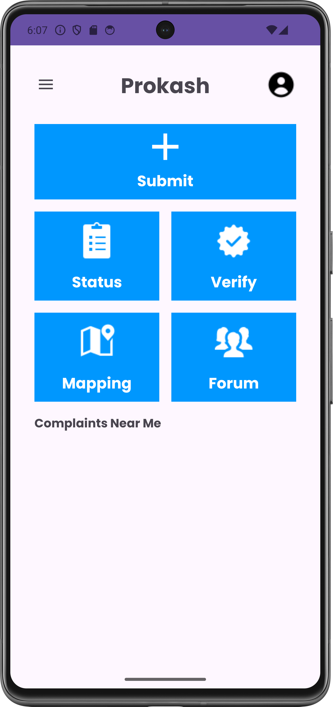
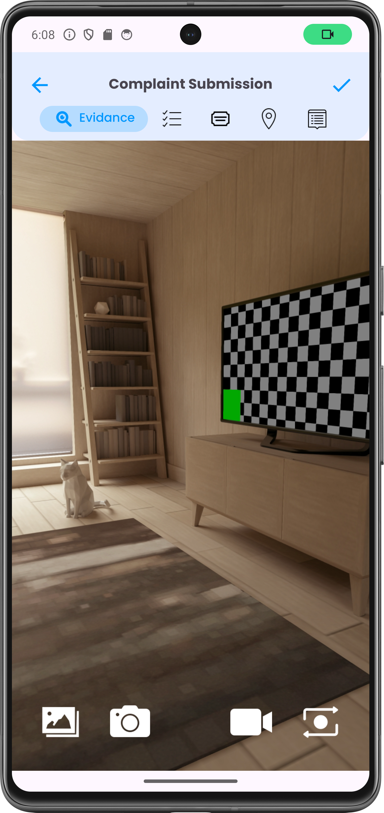
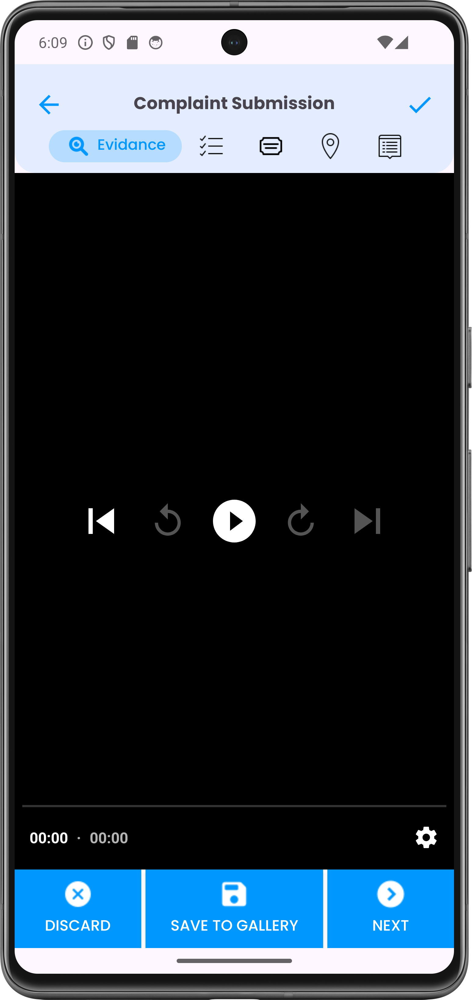
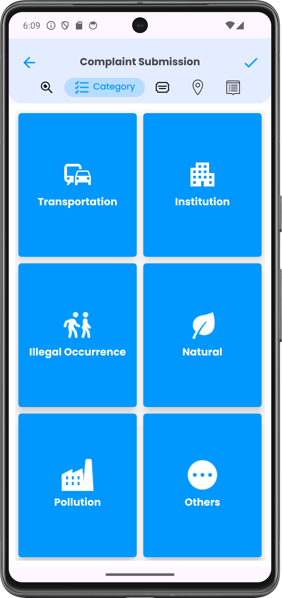
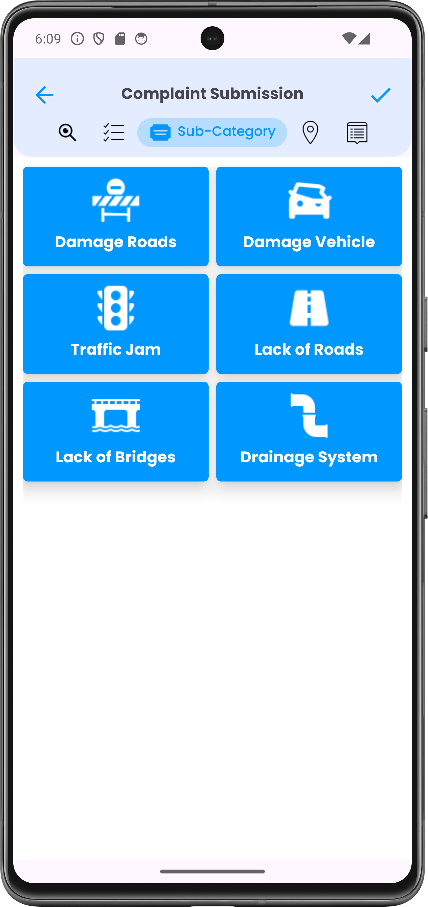
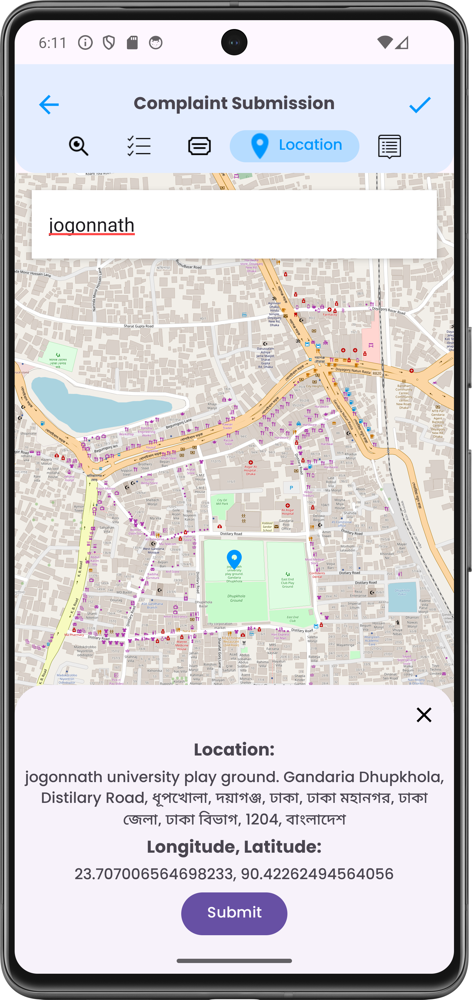
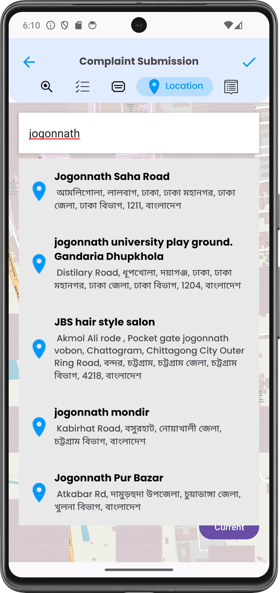
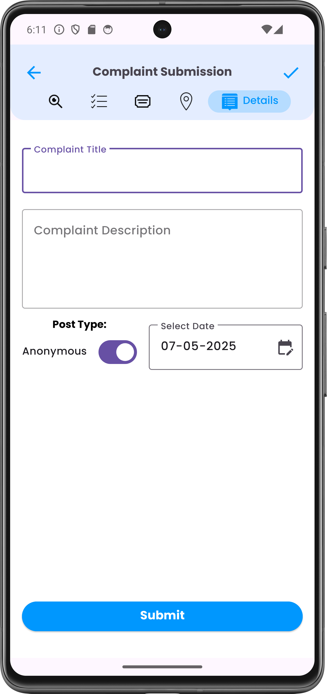
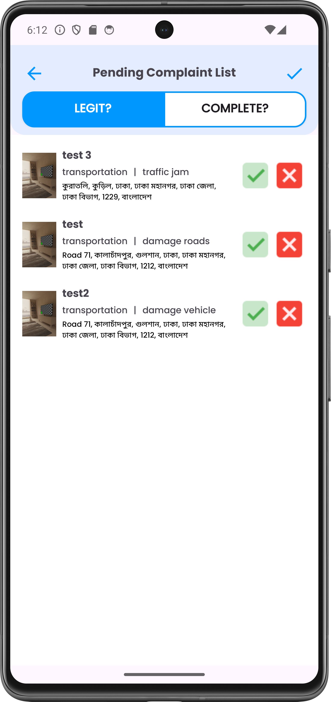

# Prokash - A Crowdsourced Complaint Submission App

**Prokash** is an Android application designed to empower citizens to report local issues and ensure transparency through public voting and location-based verification. Users can submit complaints, attach evidence, and vote on the legitimacy of others' submissions—all within a clean, intuitive interface.

## Features

- 📸 **Capture & Upload Evidence**
  - Capture images and videos directly (WhatsApp-style).
  - Select media from gallery.
  - Preview before submission.

- 🗺️ **Location-Based Complaint Submission**
  - Auto-detect location (via GPS).
  - Only nearby users (within 2 km) can vote.

- 🗳️ **Voting System**
  - Users vote once per complaint.
  - Requires 50+ votes and 80% “Yes” votes within 30 days for verification.

- 🧠 **Cloud-Based Verification**
  - Firebase Firestore for complaint and vote storage.
  - Cloud script (Colab/Python) automatically verifies complaints.

- 🔎 **Complaint Browsing**
  - See complaints around you in a RecyclerView.
  - Tap to view details and vote.

---

## 🛠️ Tech Stack

| Layer        | Technology                          |
|--------------|-------------------------------------|
| **Frontend** | Kotlin, Android SDK, RecyclerView   |
| **Backend**  | Firebase Firestore, Google Colab    |
| **Media**    | CameraX, Pix Image Picker           |
| **Cloud**    | Render (for API), Python + SMOTE for legitimacy script |
| **Location** | OpenStreetMap Location Services            |

---

## Screenshots

<table>
  <tr>
    <td></td>
    <td></td>
    <td></td>
  </tr>
  <tr>
    <td></td>
    <td></td>
    <td></td>
  </tr>
  <tr>
    <td></td>
    <td></td>
    <td></td>
  </tr>
</table>

